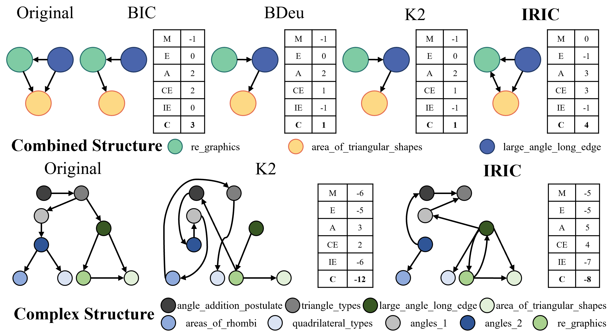

# IRIC: A Causal Network Structure Learning Method via Item Response Theory

The relationships between knowledge components are a fundamental basis for the realization of personalization in adaptive systems. Learning about correlation does not readily enable the extraction of true causal relationships between knowledge components from data. Traditional Bayesian network structure learning methods are overly generalized, missing potential insights during the learning process.

## What is IRIC?

IRIC, or *Item Response Theory based Information Criterion Causal Network Structure Learning Method*, is our innovative approach to uncover latent relationships between knowledge components by integrating **information entropy** and **causal effects**.

### Key Features

- **Integration of Information Entropy and Causal Effects**: This allows a more nuanced understanding of knowledge component relationships.
- **Structure Search Algorithm**: An evolutionary concept-based algorithm combined with a new scoring function enhances both efficiency and accuracy.
- **Proven Effectiveness**: Demonstrated exceptional performance on public and real-world datasets.

## Results
*Each circle represents a distinct knowledge component, while directed arrows illustrate the prerequisite relationships among these points. The table on the right side of the structure chart provides the scoring values for the structure, as determined by the respective methodologies employed.*
<table>
  <tr>
    <td>
      
    </td>
    <td>
      
    </td>
  </tr>
  <tr>
    <td>
      Figure 1: Comparison chart of randomly selected foundational structure learning outcomes. The learning outcomes depicted in the diagram are based on a selection of random knowledge components from the Junyi dataset.
    </td>
    <td>
      Figure 2: Comparison chart of randomly selected complex structure learning outcomes. The learning outcomes depicted in the diagram are based on a selection of random knowledge components from the Junyi dataset.
    </td>
  </tr>
</table>

<table>
  <tr>
    <td>
      
    </td>
    <td>
      Table 1: Performance Comparison
    </td>
  </tr>
</table>

*This figure visually illustrates the distribution of all individuals of superior sub-populations obtained from the nine repeated experiments of CEO-SS in the comparative experiments. We use green, yellow, and blue to represent the results for the Alarm18, Alarm24, and Alarm25 datasets, respectively. The data is presented in the form of a box plot. Simultaneously, medians are individually labeled above each axis, while the interval formed by the upper and lower quartiles is marked below each axis. Each individual is depicted with translucent points below the respective axis.*

<table>
  <tr>
    <td>
      
    </td>
    <td>
      
    </td>
  </tr>
  <tr>
    <td>
      Table 2: F1-Scores
    </td>
    <td>
      Figure 3: Convergence Analysis of the CEO-SS Algorithm.
    </td>
  </tr>
</table>

